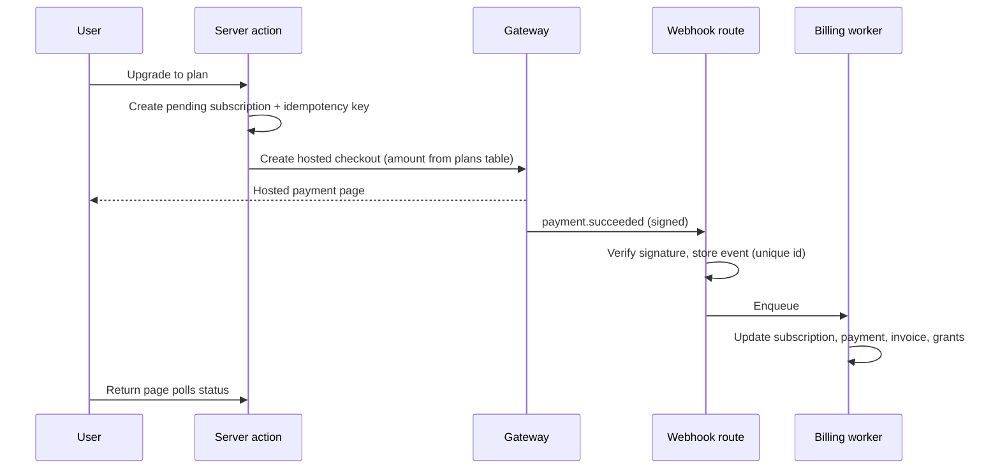

## 4b. Paid feature implementation

Every paid feature runs through one entitlement system: plans, add-ons, trials, university sponsorship and admin grants all become **entitlement grants**; server actions check or consume them in Postgres; gateways only ever move a subscription through its states via verified webhooks. The client never decides access.

### 4b.1 Code layout

| Path | Responsibility |
| --- | --- |
| `lib/billing/entitlements.ts` | `getEntitlements(subject)`, `requireEntitlement(key)`, `consumeQuota(key, n)`, `releaseQuota(key, n)` |
| `lib/billing/registry.ts` | Every paid server action declared with its entitlement key; used by tests |
| `lib/billing/checkout.ts` | `createCheckout(planId \| addOnId)`, `changePlan`, `cancelAtPeriodEnd` |
| `lib/billing/gateways/local.ts`, `gateways/mor.ts` | Gateway adapters behind one interface: `createSession`, `verifyWebhook`, `refund`, `chargeSavedMethod` |
| `lib/billing/invoices.ts` | Numbering, tax lines, PDF render |
| `app/api/billing/webhook/[gateway]/route.ts` | Verify signature, store event, enqueue; nothing else |
| `supabase/functions/billing-worker` | Processes queued webhook events and renewals |
| `supabase/functions/sponsorship-sync`, `renewal-reminders`, `quota-reset` | Scheduled jobs (below) |

### 4b.2 Tables

| Table | Key columns |
| --- | --- |
| `plans` | id (`student_pro_monthly`, `recruiter_growth_yearly`, …), audience (student/recruiter/university), interval (month/year), price\_pkr, price\_usd, grants jsonb (the entitlement template), active |
| `subscriptions` | id, subject\_type (user/org), subject\_id, plan\_id, status, gateway, gateway\_customer\_id, gateway\_subscription\_id, current\_period\_start, current\_period\_end, cancel\_at\_period\_end, trial\_ends\_at, grace\_ends\_at |
| `entitlement_grants` | id, subject\_type, subject\_id, key, value jsonb, source (plan/add\_on/sponsorship/trial/admin), source\_id, starts\_at, ends\_at, reason |
| `usage_counters` | subject\_type, subject\_id, key, period\_start, used; unique (subject, key, period\_start) |
| `payments` | id, subject, amount, currency, kind (subscription/add\_on/hire\_fee), gateway\_payment\_id unique, status |
| `webhook_events` | gateway, event\_id unique, type, payload, received\_at, processed\_at, attempts, error |
| `invoices` | number unique (`SKL-2026-000123`), subject, lines jsonb, subtotal, tax\_lines jsonb, total, currency, status (draft/issued/paid/void), issued\_at, due\_at, pdf\_path |
| `add_on_orders` | subject, kind (sponsored\_post/contact\_credits), quantity, amount, status, fulfilled\_at |
| `hire_fees` | hire\_id, org\_id, kind (intern/full\_time), amount, status (pending/invoiced/paid/disputed/void/waived), due\_at |
| `trial_claims` | user\_id unique, claimed\_at |
| `tax_rates` | province, rate, effective\_from (entered by the accountant, never hard-coded) |
| `audit_log` | None — billing actions write the shared `ops_audit_log` (5.26); there is no separate billing audit table |

RLS: billing rows are readable only by the subject (student) or the org's admin and billing roles; writes only by the billing worker (service role) and admin server actions.

### 4b.3 Entitlement keys

| Key | Type | Free / Explore | Paid values |
| --- | --- | --- | --- |
| `cv.pdf_export` | bool | false | Pro: true |
| `cv.refresh_on_demand` | bool | false | Pro: true |
| `cv.templates` | int | 1 | Pro: 5 |
| `cv.insights` | bool | false | Pro: true |
| `cv.viewer_names` | bool | false | Pro: true |
| `talent.full_profile` | bool | false | Starter+: true |
| `contact.credits` | limit per billing month | 0 | Starter 25, Growth 100, Enterprise contract |
| `org.seats` | int | 1 | Starter 1, Growth 5, Enterprise contract |
| `recruit.shortlists` | bool | false | Starter+: true |
| `jobs.active_posts` | int | 1 | Starter 3, Growth 10, Enterprise unlimited |
| `competitions.run` | limit per calendar quarter | 0 | Growth 1, Enterprise contract |
| `api.access` | bool | false | Growth+: true |
| `hire_fee.waived` | bool | false | Growth+: true |
| `org.sso` | bool | false | Enterprise: true |
| `uni.dashboard` | enum | none | Basic summary, Growth full, Campus accreditation |
| `uni.exports` | bool | false | Growth+: true |
| `uni.sponsored_pro` | enum | none | Growth final\_year, Campus all |
| `uni.job_fairs` | limit per licence year | 0 | Growth 1, Campus 2 |
| `uni.admin_seats` | int | 1 | Basic 2, Growth 5, Campus 10 |

Added 2026-09-25: `insights.post_survey` (bool) — full micro-survey breakdown on the author's own posts (5.28). On for Student Pro, university-sponsored Pro, and faculty accounts at Growth and Campus universities; off on Free.

Effective entitlements come from one Postgres function, `effective_entitlements(subject_type, subject_id)`: it merges all grants active now (bool = any true; int and limit = maximum; enum = highest tier). A student's result also includes any university sponsorship grant. Plan grants end at `current_period_end` (or `grace_ends_at` while past due).

University keys added with the portal decisions: `uni.student_records` (bool; Growth and Campus true), `uni.hackathons (limit per licence year; Growth 2, Campus 4); student key privacy.record_viewers (bool; Pro true).` Customisation of the ecosphere is available to every university and needs no entitlement.

### 4b.4 Enforcement

- Every paid server action starts with `requireEntitlement(key)` and is listed in `registry.ts`. On failure it throws `PaymentRequiredError`, which the UI turns into the upgrade sheet.
- Metered actions call `consumeQuota(key, 1)` → Postgres `consume_quota(subject, key, n)`. In one transaction it upserts the period's counter row, locks it (`FOR UPDATE`), adds purchased extras still valid, rejects if `used + n` exceeds the limit, increments, and returns what's left. A failed downstream write calls `release_quota`. Two parallel requests can never both spend the last credit.
- Paid data is also gated in RLS, not only in actions: recruiters read full profiles through `recruiter_profile_view`, whose policy calls `has_entitlement(org, 'talent.full_profile')` (security definer); Explore reads the anonymised `talent_explore` view only.
- Files: CV PDFs are served only by signed URLs minted after `requireEntitlement('cv.pdf_export')` (60-second expiry).
- The client reads entitlements only to show or hide controls.

**Counter periods:** contact credits reset at each subscription renewal; competitions per calendar quarter; job fairs per licence year. `quota-reset` doesn't delete counters; a new period simply starts a new row.

### 4b.5 Checkout and subscription lifecycle

The return page never trusts the redirect; it polls the subscription until the worker marks it active (timeout 60 s, then "we'll email you when it's confirmed").

| From | Event | To | Access |
| --- | --- | --- | --- |
| none | Trial started (students only) | trialing | Full Pro for 7 days |
| trialing / pending | Payment succeeded | active | Full |
| trialing | Trial ends unpaid | expired | Back to Free |
| active | Renewal succeeded | active | Full; new period, counters reset |
| active | Renewal failed | past\_due | Full for 7 days; retries on days 1, 3 and 6 |
| past\_due | Retry succeeded | active | Full |
| past\_due | 7 days pass | expired | Downgraded (4b.6); data kept |
| active | User cancels | active + cancel\_at\_period\_end | Full until period end, then expired |
| active | Upgrade | active (new plan) | Immediately; unused days credited to the new charge |
| active | Downgrade | active | New plan from the next period |

**Payment methods:** saved cards renew automatically. Wallets (JazzCash, Easypaisa) that can't auto-debit are handled as prepaid periods: reminders 7, 3 and 1 days before expiry with a pay link. Confirm each gateway's recurring support before build.

**Trials:** one 7-day Pro trial per verified student (`trial_claims`), no card needed; ends as Free unless paid.

### 4b.6 Downgrades and expiry over limits

| Resource | What happens |
| --- | --- |
| Seats | Before the period ends the org admin chooses who stays; if not, the most recently active members keep seats and the rest become inactive (read-only, no data lost) |
| Job posts over quota | The newest extra posts are paused (hidden), never deleted; the recruiter chooses which to reopen |
| API tokens | Revoked when dropping below Growth |
| Contact credits | Monthly credits don't roll over; purchased extras last 90 days |
| Competitions running | Finish normally |
| Student Pro | Issued PDFs stay valid; the CV reverts to the standard layout at the next monthly refresh; viewer names hide |
| University licence | Sponsored Pro ends at the end of the month; dashboard drops to the free level; data is kept |

### 4b.7 University sponsorship

- `universities` gains `final_year_batch`, set by the university admin each academic year.
- `sponsorship-sync` runs nightly: for every university with an active Growth or Campus licence it grants `source = sponsorship` Pro entitlements to students with that verified email domain (Growth: `batch_year = final_year_batch`; Campus: all), and ends grants that no longer qualify at the end of the current month.
- Students get 30 days' notice before sponsorship ends, with an offer to continue Pro personally. A student who already pays is told when sponsorship starts and can cancel at period end; nothing is paused automatically.

### 4b.8 Add-ons

- **Contact credits:** paid order → `entitlement_grants` row (`contact.credits`, `source = add_on`, 90-day expiry) that `consume_quota` adds to the monthly limit.
- **Sponsored post:** paid order → `job_posts.sponsored_until = now + 14 days`; the post shows the "Sponsored" label in the feed and job list, never in talent search ranking.

### 4b.9 Hiring fee

1. Moving an application to **hired** creates `hires` and, unless `hire_fee.waived`, a `hire_fees` row (PKR 10,000 intern / 30,000 full-time).
2. An invoice is issued immediately, due in 30 days, with a pay link.
3. The recruiter can dispute within 14 days (candidate withdrew within 30 days, or marked in error); an admin resolves it to paid, void or waived.
4. Unreported hires: when the student sets "hired at X", or an application sits at **offer** for 45 days, an admin follow-up task is created.
5. Unpaid after 30 days: the org can't send new contact requests until it pays.

### 4b.10 Invoices and tax

- Invoice numbers come from a Postgres sequence per year (`SKL-YYYY-NNNNNN`), never reused; corrections are credit notes.
- Organisations record their `province`; tax lines use `tax_rates` for that province on the invoice date.
- PKR invoices are rendered to PDF by the same Chromium renderer as CVs and stored in a private `invoices` bucket. USD sales via the merchant-of-record carry their invoice; Skilient stores its reference.

#### 4b.11 Staff billing tools (`/ops/billing`)

- Search any student or org; see subscriptions, grants, counters, payments and invoices.
- Manual grant with reason and expiry (for example, Growth free for 6 months for the 20 launch partners), quota override, comp plan, void invoice, refund through the gateway API (creates a credit note), resolve hire-fee disputes.
- Every staff billing action writes `ops_audit_log` with before and after values and a reason (5.26).

### 4b.12 Security

- Webhooks: signature verified with the gateway secret, timestamp within 5 minutes, `event_id` unique so replays are ignored; the route only stores and enqueues.
- Amounts always come from `plans` and `add_on_orders` on the server, never from the client; checkout creation uses idempotency keys.
- Gateway secrets are server-only env vars; only the billing worker uses the service role.

### 4b.13 Testing and done criteria

- Gateway sandboxes for both gateways; recorded webhook fixtures for every event type; a replay test proves duplicates change nothing.
- A registry test fails the build if any server action touching a paid table isn't in `registry.ts`, then calls every registered action as a user without the entitlement and expects `PaymentRequiredError`.
- A concurrency test: 50 parallel contact requests against 1 remaining credit → exactly 1 succeeds.
- Lifecycle tests: trial → active, renewal failure → past due → expired, upgrade credit, downgrade with seat selection, sponsorship grant and expiry, add-on expiry, hire fee → dispute → void.

**Build milestones** (inside the section 11 sequence, before the closed beta):

| # | Milestone | Done when |
| --- | --- | --- |
| B1 | Plans, grants, `effective_entitlements`, `requireEntitlement`, `consume_quota`, registry | Registry and concurrency tests pass |
| B2 | Gateway adapters, checkout, webhooks, worker, lifecycle | Every lifecycle test passes in sandbox |
| B3 | Add-ons, hire fees, invoices, tax | A PKR test invoice with tax renders and reconciles |
| B4 | Sponsorship sync | A test university's final-years get and lose Pro correctly |
| B5 | Admin billing tools and audit log | Every admin action is logged with before and after |
| B6 | End-to-end: real test transactions in PKR and USD | Launch-gate billing check passes |
