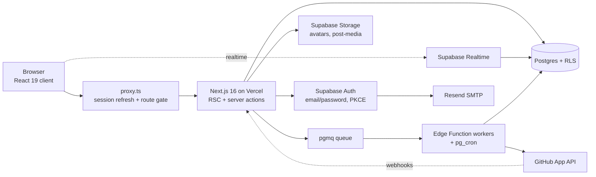

## 7. Architecture and tech stack

One Next.js 16 App Router app on Vercel, backed entirely by Supabase; no separate API server, queue or Redis. Postgres RLS is the authorisation boundary.

The browser talks to Supabase directly only for Realtime subscriptions and storage uploads; every mutation goes through a server action.

| Layer | Choice | Why |
| --- | --- | --- |
| Framework | Next.js 16 App Router, React 19, TypeScript strict | Server actions remove the need for a custom API; `proxy.ts` replaces `middleware.ts` in v16 |
| Styling | Tailwind CSS v4 via `@tailwindcss/postcss`, tokens in `app/globals.css`, no component library | CSS-first config; one design system (see section 9) |
| Auth | Supabase Auth + `@supabase/ssr` cookies | One client pattern on client and server avoids PKCE verifier mismatches |
| GitHub | Skilient GitHub App (installation tokens, webhooks, private repos). NextAuth is removed. | Used only for skill extraction, never as sign-in |
| Data | Supabase Postgres + RLS, Realtime, Storage | Managed, row-level security enforced even on direct API calls |
| Background jobs | Deno Edge Functions + pg\_cron + pgmq | GitHub import workers (every minute), feed-stage (5 min), quality-index 02:00, ranking-compute 03:00, decay-apply 04:00, anti-gaming 05:00, sponsorship-sync, cv-refresh, notification-digest, graduate-rollover, account-deletion, job-watchdog and the billing worker; every run logged in `job_runs` |
| Email | Resend as custom SMTP for Supabase Auth, plus notification, digest, university-request and alert emails | Supabase's default mailer is capped for dev use |
| UI libs | framer-motion, Phosphor icons, next-themes | Animation, icons, theme toggle |
| Observability | Sentry, Axiom, PostHog (EU), Vercel Analytics + Speed Insights, UptimeRobot | All on free tiers at launch (see "Observability, monitoring and analytics") |

**Route map**

| Access | Routes |
| --- | --- |
| Public | `/`, `/recruiters`, `/universities`, `/faculty`, `/about`, `/pricing`, `/verify/[code]`, `/signin`, `/signup`, `/forgot-password`, `/reset-password`, `/auth/callback`, `/auth/confirmed`, `/api/public/*` |
| Signed in | Students: `/onboarding/[step]`, `/feed`, `/opportunities/[tab]`, `/ventures` (+ `/new`, `/[id]/[tab]`), `/chat`, `/chat/[threadId]`, `/me/(skills\|work\|cv\|score)`, `/profile/[username]`, `/settings/*`, `/explore`, `/leaderboard`, `/events`, `/friends`, `/notifications`, `/announcements`, `/requests`, `/feedback`, `/agreement`, `/u/[slug]`. Other roles: `/recruit/*`, `/org/*`, `/teach/*`, `/uni/*` |
| Admin | `/ops/*` (Skilient staff only, two-factor required) |

**Code conventions**

- `lib/supabase/client.ts` (`createBrowserClient`) and `lib/supabase/server.ts` (`createClient` with `cookies()`, plus `createServiceClient` for admin actions only). One module per concern.
- `lib/actions/*.ts` — server actions for every mutation. Derive the user id from `getUser()`, never from arguments; check ownership explicitly; verify writes with `{ count: "exact" }` because an RLS-blocked write returns no error.
- `lib/data/*.ts` — read fetchers using the session client, so RLS always applies.
- `components/shared/` primitives (`AppShell`, `Button`, `Avatar`, `PostCard`, `ChatBubble`, `EmptyState`, `LoadingState`, `FilterChips`, `ReportButton`, `TierBadge`, `SkillTag`, …), `components/entity/` for the shared venture list/detail, `components/marketing/` for the public pages.
- Providers at the root layout: `CurrentUserProvider` (`useCurrentUser()`), `ThemeProvider`, `PostHogProvider`. There is no NextAuth. Hooks: `useCurrentUser`, `useMounted`, `useThemeMode`.
- Navigation: five areas from one `lib/nav.ts` config (5.25) — desktop sidebar and phone bottom tab bar: Home, Opportunities, Ventures, Chat, Me; secondary items (Explore, Leaderboard, Events, Friends, Notifications, Feedback) in the top bar or inside Me; every item has a tooltip (5.27). Recruiter, teacher, university and staff portals have their own sidebars.

#### Build: project scaffold

- **Create:** create-next-app (TypeScript strict, App Router, ESLint, Tailwind v4), package manager pnpm, Node 22; add `@supabase/ssr`, `@supabase/supabase-js`, zod, next-themes, `@phosphor-icons/react`, framer-motion, `@tanstack/react-query` (client caches for feed and chat), react-hook-form + `@hookform/resolvers`, resend, `@noble/ed25519`, qrcode, `@sparticuz/chromium`, puppeteer-core, `@octokit/app`, `@sentry/nextjs`, posthog-js, posthog-node, `@floating-ui/react` (tour).
- **Folders:** `app/` (route groups (marketing), (auth), (app) with the app shell, ops, recruit, org, uni, teach, api), `components/{ui,app,marketing}`, `lib/{actions,data,billing,github,cv,supabase,security,validation,tours}`, `supabase/{migrations,functions,tests,templates}`, `tests/{unit,e2e}`.
- **Server actions pattern:** every action is `action(schema, handler)` from `lib/actions/_wrap.ts`: parses input with Zod, gets the user via `getUser()`, runs the handler, maps known errors (`PaymentRequiredError`, `RateLimitedError`, `ValidationError`) to typed results, and logs unknown errors with the action name.
- **Lint rules:** no `service_role` imports outside allowed folders; no `getSession()` in server code; no raw `fetch` to Supabase REST.
- **Hosting:** Vercel (preview per PR, production on `main`); Supabase Edge Functions deployed by CI.
